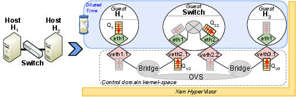

.. _selena_advacned:

SELENA under the hood
=====================

In this section of the tutorial, we provide some further details on the
architecture of SELENA. Specifically, we discuss how SELENA implements time
dilation in the hypervisor, how SELENA coordinates command execution between
client nodes and how a user can build a mirage switch emulation model.

Time dilation
-------------

In order to implement the time virtualisation mechanism of SELENA in the XEN
hypervisor, we introduce a number of minor code modification in the time
subsystem of XEN. Each PV guest is contains a time driver which is integrated
with the XEN platform and allows guest VMs to read time from the Hypervisor, as
well as schedule time events. 

In terms of time-keeping, Xen exposes to guests two timestamp values, the
system-time (time since guest boot or resume) and the wall-clock time (time
since epoch when system-time was zero), through a shared memory structure
(shared_info_page). System-time is updated by Xen every time the guest is
being scheduled. In between updates, the guest keeps accounting of wall-clock
and system time by extrapolating the current values based on the value of TSC
register (an x86 register counting CPU clock cycles). TSC values in Xen are
obtained through the rtdsc instruction. They are either native, accessed
directly from the CPU register, or emulated, intercepted through a trap by Xen.
In order to effectively virtualize time-keeping, the hypervisor multiplies with
the TDF parameter all the wall-clock, system and emulated TSC time values
provided to the guest. Additionally, because native TSC values are
unmodifiable, our approach multiples with the TDF value the TSC scaling factor
(tsc_to_system_mul), a constant used by the guests to convert TSC cycles to
system time.

In terms of time event scheduling, the guest PVOPS driver intercepts and
translates such requests to equivalent Xen hypercalls
(HYPERVISOR_set_timer_op). When the timer expires, the hypervisor delivers a
software timer interrupt (VIRQ_TIMER) back to the guest and triggers the
associated timekeeping interrupt handlers. Time event virtualization in SELENA
is achieved in the hypervisor by intercepting timer-setup hypercalls and
scaling their timeout values with the TDF parameter. Our approach also covers
the case of periodic timer events used by older Linux versions. Recent Linux
kernels also employ loop-based delays for timeout values lower than 10 usec.
These types of events are not directly managed by the hypervisor, but our
approach ensures accurate event execution.

Using these simple tricks, SELENA can exploit XEN support for heterogeneity,
while allowing experiments to virtualize time. At the current development state
of the SELENA, our support to modify time dilation factor(TDF) at run time is
limited, due primarily to luck of interest to enable this feature and in
addition because a clean restart between TDF values enforce a purging of the
running host with stale configurations. Nonetheless, enabling time dilation
factor dynamics can be trivially introduced and we are planning to enable it
in future releases. In the current version, TDF value modification are hardcode
in the source code of the hypervisor and require from the experimenter to 
update the source code, recompile incrementally the source and replace 
the hypervisor binary. 

Coordination service
--------------------

In order to allow SELENA to run experimental commands distributely we have
implemented a simple remote execution service. The service consists of a single
coordination service, running on Dom0, and multiple coordination client
services running within the guest VMs. The coordination server receives
commands from the SELENA Scenario and distributes them to respective VMs.

In order to implement the coordination protocol, SELENA uses the Xenstore
service. Xenstore is a PubSub service with a filesystem like abstraction and is
used by the XEN hypevisor as a distributed registry between the Dom0 and the
guests. Each guest has a unique tree in Xenstore, under which SELENA adds a
SELENA directory on which the server and clients exchange commands and output. 

The channel uses the following entries in the SELENA xenstore directory: 

* *bootipaddr, bootipmask*: These entries are set once the VM is booted and they are used to configure the addressing in the management interface of the experimental hosts. 
* *cmd, response, retstatus* : These entries are used to propagate commands to the client and receive stdout and return status of the process. cmd is set from the server to push for commands, while response and retstatus are set by the client once the command completes execution. 
* *lock* : This entry is used by the client to notify the server that it is processing a previous command. This will deffer the server from pushing additional commands to the client and wait for outcome from the client for previous commands. 

Switch emulation
----------------

Switch control emulation is implemented in SELENA using the OpenFlow switch 
library of the Mirage service. In order to create a new switch model a user 
can download the `ocaml-openflow <http://www.github.com/crotsos/ocaml-openflow>`.
in order to recompile a new version of a switch you need to update the 
switch delay model parameter in file switch/basic_switch.ml and rerun make. 
This will generate a new ofswitch.xen file, which be used copied to the folder
/boot/guest/ and used in the VM_args argument in the VM param list.
