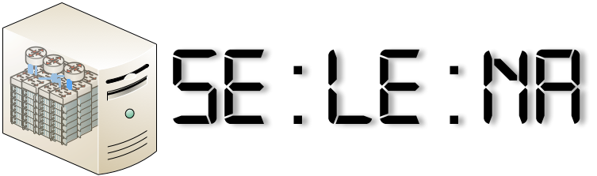

What is SELENA?
===============

SELENA (Scalable Emulation of LargE Network Architectures) is an holistic
network experimentation platform. SELENA builds around XEN and is capable to
emulate experiments of increasing size. SELENA supports by design **real
network replication**, **controllable trade-off between experimental fidelity
and execution time** and **extensive OS and application compatibility**. An
intuitive and simple Python API enables simple network topology and
experimental scenario defintion and seamless deployment. 

Features
========

.. container:: feature

    .. image:: _static/TARDIS_by_Ambient_Lullaby.png
        :name: Time Dilation
        :class: imglabel

    **Time dilation** builtin the XEN hypervisor. Experimenters can
    homogeneously slowdown experimental time progression. Experimental time
    virtualization is implemented in the XEN hypervisor and supports any PV
    guest (e.g. Linux, BSD etc.).

.. container:: feature

    .. image:: _static/reproducibility-small.png
        :name: Reproducibility
        :class: reproducibilityLabel

    **Reproducibilty** through a pythonic experiment description API, which
    automates deployment and execution, and support for all PV guests, which
    provides full POSIX real-world applications and network stacks support.

.. container:: feature

    .. image:: _static/scalability.png
        :name: Scalability
        :class: scalabilitylabel

    High **Scalability** with the muscles of the XEN platform. Additionally,
    *fidelity at scale* by controlling time progression in emulation and
    allowing resource scalability at a unit of experimental time.

.. container:: feature

    .. image:: _static/openflow-logo.png
        :name: SDN
        :class: sdnlabel

    **Software Defined Networking** support, providing compatibility with all
    popular software switch and controller implementations and OpenFlow switch
    emulation, providing high realism in control plane emulation.
